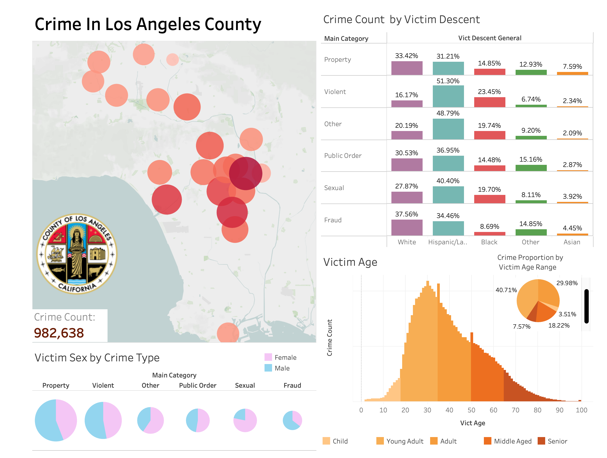
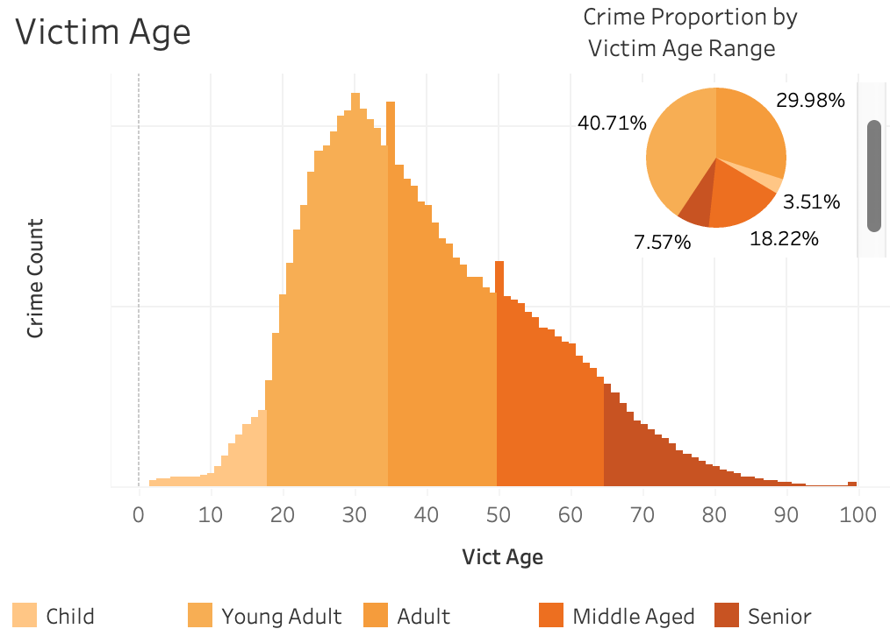
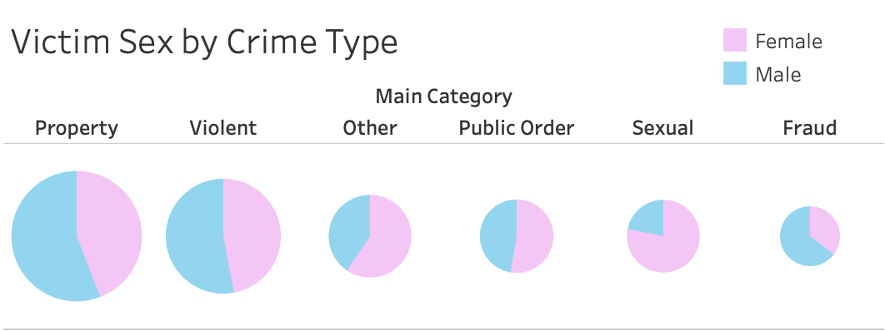
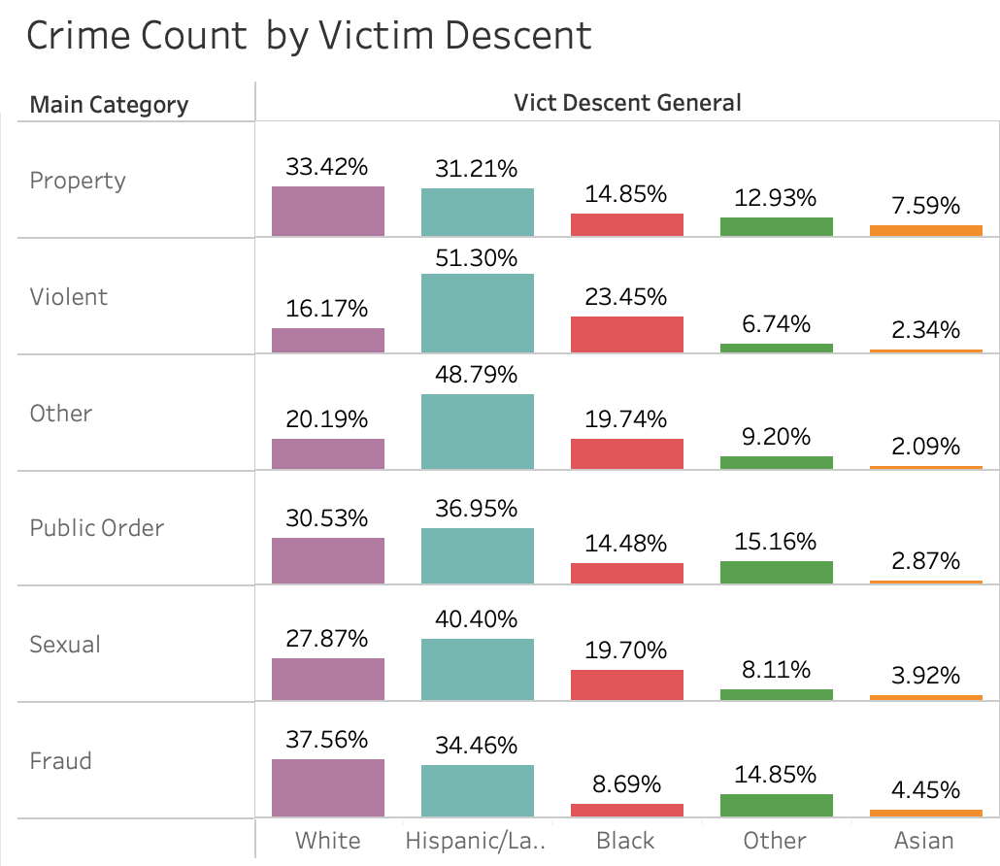

# Los-Angeles-Crime-Analysis

## Introduction
In this project I used Python, PostgreSQL and Tableau to analyze and visualize  geographic and demographic trends in Los Angeles crime data.  My goal with investigating this data was to find meaningful insights that would benefit the people, workers, and police departments of LA county. I hope by making my dashboard public that the Los Angeles crime data can be more accessible and interpretable for the average person, and that my visualizations can inspire more curiousity and research.

*Preview of dashboard:*

## Table of Contents
1. [Project Overview](#project-overview)
2. [Analysis](#analysis)
3. [Real-World Application](#Real-World-Application)
4. [Improvements for the Future](#Improvements-for-the-Future)

## Project Overview
#### Data Sources: 
- Crime data is downloaded directly from LA county's data website: [la crime data](https://data.lacity.org/Public-Safety/Crime-Data-from-2020-to-Present/2nrs-mtv8/about_data)
- Because of the size of the csv file, I could not directly store the raw data in the repository, but it can be downloaded by anyone using the link above

#### Data Preprocessing and Initial Exploration (Python): 
`eda.ipynb`

- Using python notebook to assess quality of data and choose features to use in final database

`data_preprocessing.py`
- Initial data cleaning and structuring using Python on raw CSV files 
- Implementation of function to categorize over 150 different crimes into more general labels such as violent, property, etc
#### Database Transformation (PostgreSQL): 
`database.setup.sql`

- Further data processing and wrangling using SQL scripts
- Setting up final relational database with PostgreSQL for efficient querying and easy integration with Tableau
#### Visualization (Tableau): 
- Building an interactive Tableau dashboard linked to the PostgreSQL database to visualize trends and insights
- Utilizing Tableau's actions feature to produce visualizations of victim demographics and crime types for specific areas in los angeles by manually selecting them in the dashboard UI

## Analysis 
In this section I will provide some patterns and insights I found using Tableau and the dashboard I created. For simplicity, the visualizations are generated on the entire dataset, so if you would like to see them for a given area or set of areas, refer to the dashboard link from earlier or downloaded the workbook yourself from the repository.

### Location 
*Which areas of Los Angeles generate the most of each type of crime?*

- Central to southeastern LA generate the most violent crime
- Fraud is most common in the most northern and west areas like Mission, Topanga, and West LA.
- Besides a couple exceptions, property crime is the most consistent across all areas.
- Sexual crime seems to be present in most areas, with more concentration from Hollywood to Southeast LA.
  
### Victim Age 
*Which age groups are more likely to be victims of crime?*

- Here we can see the distribution of victim ages form a bimodal distribution, the two peaks being age 30 and 50. One possible cause of this could be population density. Looking at the [following article](https://www.neilsberg.com/insights/los-angeles-county-ca-population-by-age), in figure 1, we observe one peak at age 25-39  and the essence of a peak around 45-54, similar to the distribution of victim ages pictured above.
  
- Additionally, it  seems the 25-39 range has an even larger peak in victima ages, which makes sense since that age group is likely the most active in Los Angeles because of a combination of youth, work, and financial independence.
- It seems that victims are much more likely to be victims of crime once they become 18 years old
- There are two unual spikes at age 35 and 50, but after further investigation I found that in some areas the police department logged most of their crimes for those two ages specifically. This is likely because in data entry, those departments choose to estimate the victim age rather than input victims' exact ages.

### Victim Sex
*Are certain crime types more prevalent among victims of one sex over the other?*

- Note that in the dataset, male and female are the only defined factors for victim sex. There was an 'unknown' factor, but it was amibiguous what this encompassed so I excluded it from the dashboard
  

- Men make up a significant proportion of victims in both property and violent crimes. This trend may stem from social perceptions that frame men as tougher abd  'fair game', potentially leading criminals to target them more frequently. However, there are notable exceptions. In cases of intimate partner violence, women are more frequently targeted, highlighting how patterns of victimization can vary based on the relationship context. Identity theft also stands out as an exception in property crimes, where gender differences are less pronounced and the crime is less phyiscally confrontational.
  
- The only areas that had a majority of female victims were 77th street and Southeast
  
- Nearly all sexual crimes overwhelmingly affect female victims, with women comprising up to 99% of victims in some cases. 

### Victim Descent
*Are some descents disproportionately targeted in specific types of crimes/areas? be useful for los angeles county ?*
- Analyzing data on victims' ethnic backgrounds requires careful ethical and contextual consideration. Without any data on the descent populations for each police department area, I will be brief with this section
  

- Crime volume varies substantially across different ethnic backgrounds in each area, likely reflecting the population demographics within those regions. This is evident in areas like Mission, 77th Street, and Southeast
- The proportion of white victims in violent crime is significantly lower than the other crime types. Upon further investigation, I found that this was consistent across most areas as well. 
- Property crime seems to have the most balanced distribution amongst the victim descents, which aligns with our previous finding, which was that property crime was consistent across all area locations.

## Real-World Application
I think the findings in this analysis have multiple applications and uses for the real-world. 
-  *Effectively Distributing Resources:* The visualizations clearly display which areas generate more crime, which can help determine resource allocation across the county. For example, the dashboard reveals that fraud is very common in the very nothern and western areas of Los Angeles; with this information, these areas can invest more into units that specialize with this type of crime. 
-  *Understanding Vulnerable Groups:* Knowing which demographics are more frequently targeted within each area allows for targeted outreach, education and involvment of other organizations. For example, in areas like Southeast and Central LA, there is a high proportion of child victims and young adults, indicating the need for involvment of the Department of Children and Family Services (DCFS) in these areas.
-  *Highlighting Crime Types by Sex of Victim:* Insights into how crime types vary by sex can raise awareness for prevention campaigns, support services, and even self-defense initiatives tailored to those at higher risk. For example, the pie charts displayed how sexual crimes are much more prevalent towards females, a statistics that can be used to help raise funds and awareness for said victims.

### Improvements for the Future

- It is important to note that there are many details that the dataset lacks that would help to make more robust conclusions about crime in LA. For instance, our main metric crime volume does not take into account the  population for each descent, sex, and age within each area. Because the police departments have an ambiguous radius for covering crimes, I found it difficult to find a population dataset that could be joined with the crime dataset. I hope in the future that the population data will become more accessible on the website, which would open more avenues of analysis.
- In this project I tackled geography and demographics, but moving forward I am also interested in the temporal aspect of crime volumne? I am curious to see how the time of year affects the number of crimes for each area, and if it is possible to forecast crime using this dataset. 
  

